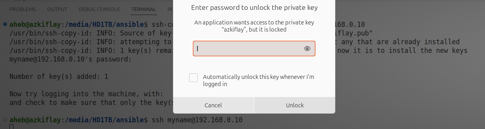
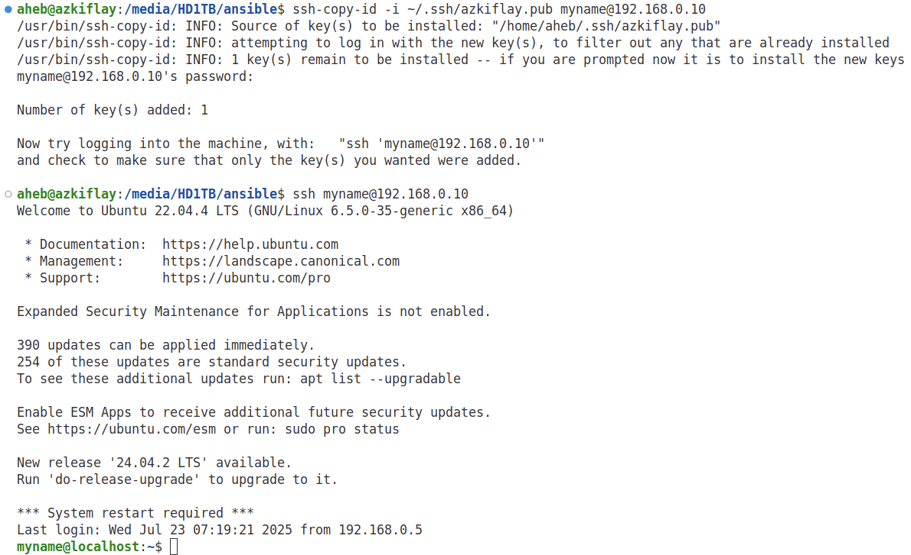
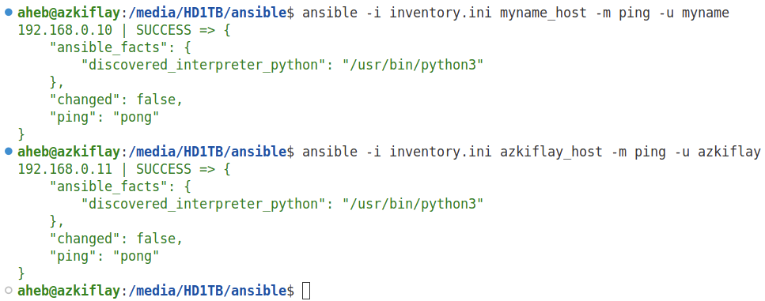

# Introduction to Ansible
Servers can be configured individually, but doing so is tiring, time-consuming and error prone. Ansible is an open-source Configuration Management (CM) tool that enables system administrators to control state of servers. Puppet, Chef, and Salt are other CM tools. CM tools are used to define and enforce desired state for servers, as well as other networked hosts and devices. For example, software package installation, configuration, permissions, and running the necessary services are among the things Ansible and other CMs can do. Ansible uses domain-specific language to describe the state of servers. Moreover, Ansible can be used for deployment of software ready to be released from a developers team. To achieve that, Ansible can copy the required files to servers, change configuration and environment variables, and start services in a particular order. 

Ansible orchestrates infrastructure such as virtual machines (VMs). Ansible is written in Python. While tools such as Vagrant and Terraform are Infrastructure as Code (IaC) systems, Ansible is widely adopted to manage the configuration of infrastructure. Ansible uses Yet Another Markup Language (YAML) to describe the desired state of infrastructure. As a result, Ansible has a *declarative* configuration style rather than *imperative*. In the latter the user specifies detailed description of the infrastructure, while a description of the infrastructre state suffices in Ansible.

Moreover, unlike other CM systems, Ansible is agentless because it does not require a software agent to be installed on the managed hosts. Ansible utilizes Secure Shell (SSH) to push configuration to hosts and make the desired changes accordingly. With SSH being the most secure method to connect to remote hosts, Ansible leverages SSH to configure a number of hosts.

<!-- Using Ansible (User and Group Mangement, Two-factor authentication over SSH, User security policy such as controlling user commands, Host-based Firewall Automation) -->

# Ansible Terminology and Workflow
* Control node: a Linux/Unix machine where Ansible has been installed. It is possible to have more than one control nodes. A Windows machine cannot be a control node.
* Managed nodes (hosts): Network devices or servers managed by Ansible. Managed hosts do not have have Ansible installed on them.
* Inventory: a file that contains a list/group of hosts that an Ansible control node works with. Inventory file is created at the control node, specifying details of managed hosts such as IP addresses, and domain names. Host information in an inventory file can be organized in groups and subgroups.
* Module: a piece of code that Ansible executes to perform specific actions on different operating systems and environments. One more more modules can be used in tasks and playbooks.
* Tasks: Units of action in Ansible. For example, a command to install software on a managed host is a task.
* Playbook: an *ordered* lists of tasks that can be run by the control node to configure remote hosts. Playbooks are run in control node to configure remote hosts. YAML is used to write playbooks, which can include tasks and variables.

Broadly, the Ansible workflow includes the following major steps:
* Ansible controller uses *SSH* to connect to a host or groups of hosts.
* The controller makes changes to host(s) using ad-hoc commands or using an inventory file.
* Transfers one or more Ansible modules to host(s).
* Executes the module(s) at the host(s).

# Ansible Installation
The following commands can be used to install Ansible on Ubuntu. While Ubuntu 24.04 LTS was used in this tutorial, the commands will likely work on other Ubuntu distributions with minor changes.

```bash
sudo apt update
sudo apt install software-properties-common
sudo add-apt-repository --yes --update ppa:ansible/ansible
sudo apt install ansible
ansible --version
```
Instructions to install Ansible in other major operating systems are available [here](https://docs.ansible.com/ansible/latest/installation_guide/installation_distros.html).

# SSH Configuration
Before the controller can do anything on the managed hosts, it needs to be connected to them. As stated earlier, such network connection is setup using SSH. Therefore, it is important to ensure SSH is available and configured correctly on the controller and managed hosts. Moreover, to avoid a rogue controller taking over the infrastructure, a key-based or passworkd-based authentication must be enforced. In most cases, a key-based authentication is preferrable. The next steps show how to configure public and private keys for SSH, requiring the controller to be authenticated by the remote hosts.

When a key-based authentication is setup, managed hosts can use public key of the controller node to authenticate it. The controller's private key should be kept locally and securely. In other words, the public key should be known to the managed nodes for them to be able to create a message that can be read only using the private key of the controller node. The rests of the authentication process is automatically triggered at each node after the private and public key pair have been configured at the respective hosts.

Firstly, public and private keys are generated at the controller. Secondly, the controller's public key has to be transferred to the managed hosts, letting them know about the controller and its public key. This requires a valid username and password to access a managed host and transfer the controller's public key. With the private and public keys in the right places and pre-existing password-based access at the managed hosts, the controller is then configured to connect to the managed hosts using a key-based authentication.

## Creating public and private keys
The *ssh-keygen* command is widely used to create the private and public keys for and at the controller. For example, the following creates a private and public keys and saves them inside the *~/.ssh* directory. The file name of the private key is *ansible_key*, while the public is *ansible_key.pub*. While any name can be given for the key pairs, the *ssh-keygen* command provides default names of *id_rsa*, and *id_rsa.pub*, for the private and public keys, respectively.
```bash
  ssh-keygen -t rsa -f ~/.ssh/ansible_key
  ls -l ~/.ssh/ansible_key # Private key permissions
  nano  ~/.ssh/ansible_key # View the private key
  ls -l ~/.ssh/ansible_key.pub # Public key permissions
  nano ~/.ssh/ansible_key.pub # View the public key
```

## Transferring the public key to hosts
To be able to transfer the controller's public key to the managed hosts, you need to have an existing password-based access to the latter. In other words, you should already be able to use *ssh* to login remotely to the managed hosts using the respective username and password as shown in the following example.
```bash
  ssh myname@192.168.0.10 # ssh-keygen -R 192.168.0.10 # deletes any old key entry from ~/.ssh/known_hosts
```

After ensuring the managed hosts can be accessed using a password-based authentication, the next step is to configure *ssh* to use the private and public keys created earlier for authenticating the Ansible controller with the managed hosts. But first we need to transfer the public key to the hosts. To that end, *ssh-copy-id* command followed by each host's IP address or domain name is used as shown in the following example. Note that the public key was created with a custom name earlier. Therefore, that the name of the public key has to be specified using the *-i* option.
```bash
  ssh-copy-id -i ~/.ssh/azkiflay.pub myname@192.168.0.10 # ssh-copy-id --> uses locally available keys to authorise logins on a remote machine
```

A passphrase is requested to access the private key, "azkiflay" in this case, as shown in Figure 1. The password of the user account where the key pair were created is the passphrase.
<p align="center">
  
</p>
<p align="center"><strong>Figure 1:</strong> Unlocking the private key </p>

Following a successful entry of a password, the public key of the Ansible controller is added to the remote host as depicted in Figure 2.
<p align="center">
  
</p>
<p align="center"><strong>Figure 2:</strong> Transferring public key to a remote host </p>

Therefore, the public key of the Ansible controller has been copied to the remote host's authorized_keys file. As a result, the controller can now access the remote host without a password, using the public key. As shown in Figure 3, when "*ssh myname@192.168.0.10*" is issued to access remote host, no prompt appears asking for a password. 
```bash
  ssh myname@192.168.0.10 
  # ssh -p port_number myname@192.168.0.10 # If ssh is not running on the default port number 22
  # ssh myname@192.168.0.10 command_to_run # To execute a single command on a remote system
  # ssh -X myname@192.168.0.10 # If X11 forwarding is enabled on both local and remote systems
  exit # Terminate the connection
```

The reason for the passwordless login is because the public key of the controller has now been added to the remote host's authorized_keys file. The presence of the public key at the remote host can be verified using "*cat ~/.ssh/authorized_keys*" by connecting to it. With regards to the private key, the clue is in the name. It should be kept private and secure at the controller, which uses it to decrypt messages from remote hosts. Figure 3 depicts that the Ansible controller has been successfully authenticated by managed host (192.168.0.10). This was possible because the host has the controller's public key in its *authorized_keys* files, also shown in the second line of the "*~/.ssh/authorized_keys*"" command issued at the managed host.

<p align="center">
  
</p>
<p align="center"><strong>Figure 3:</strong> Public key-based access to a remote host </p>

# Telling Ansible About Your Servers
For the purpose of this tutorial, two servers have been made available.  have two servers
```bash
  nano inventory.ini
```
The inventory.ini file contains a list of hosts that the controller will be managing. Ansible can administer several hundreds and thousands of hosts. For demonstration, lets add two hosts as shown below.
```bash
  [myname_host]
  192.168.0.10
  [azkiflay_host]
  192.168.0.11
```

Then, we can use the ad hoc command below to check connectivity of the controller to a managed host. Note the *-i*, *-m*, and *-u* options are used to specify the inventory file at the controller, the command to execute, and a user name at the managed host, respectively.
```bash
  ansible -i inventory.ini myname_host -m ping -u myname
  ansible -i inventory.ini azkiflay_host -m ping -u azkiflay
```

Figure 4 shows the results of the ad hoc ansible tasks above. The ping results indicate that the controller can reach both hosts successfully.
<p align="center">
  
</p>
<p align="center"><strong>Figure 4:</strong> Checking controller's to hosts using ad hoc command </p>

The first ad hoc command results in "UNREACHABLE!" error for both hosts. Paricularly, the *msg* part of the results states ""msg": "Failed to connect to the host via ssh: aheb@192.168.0.10: Permission denied (publickey,password)". This makes sense because the local username *aheb* does not exist on both of the hosts in the inventory.ini file. 
```bash
  ansible -i inventory.ini all -m ping
```

To tackle this problem, the username on a host can be specified using the *-u* option, as has been done in the following.
```bash
  ansible -i inventory.ini all -m ping -u azkiflay # returns error on one of the hosts, but successful on the other host
```

Figure 5 shows the full results of the various ad hoc commands that test connectivity of the ansible controller and the hosts in its inventory.ini file.
<p align="center">
  
</p>
<p align="center"><strong>Figure 5:</strong> Checking controller's to hosts using ad hoc command </p>

# Making Changes to Managed Hosts
The whole point of automation using Ansible is to realize a change of state at the managed hosts. Restarting a server, creating users, copying files are examples of such changes of state, all of which can be implemented using ad hoc tasks or playbooks.

## Ad hoc tasks
Ad hoc tasks are suitable for tasks that are not done repeatedly. The following examples show ad hoc tasks that implement changes at the respective managed hosts.
```bash
  ansible -i inventory.ini hosts -m ping -u myname
  ansible atlanta -a "/sbin/reboot" # Restarting all server all the servers in the [atlanta] group:

```


# Future
* WinRM and SSH based connection between Ansible controller and managed hosts
* Real-world Ansible usage scenarios/projects


# Refrences
