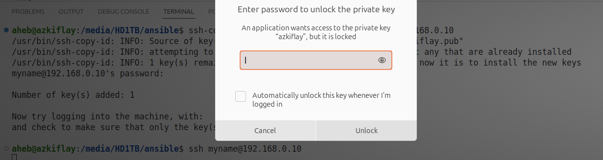
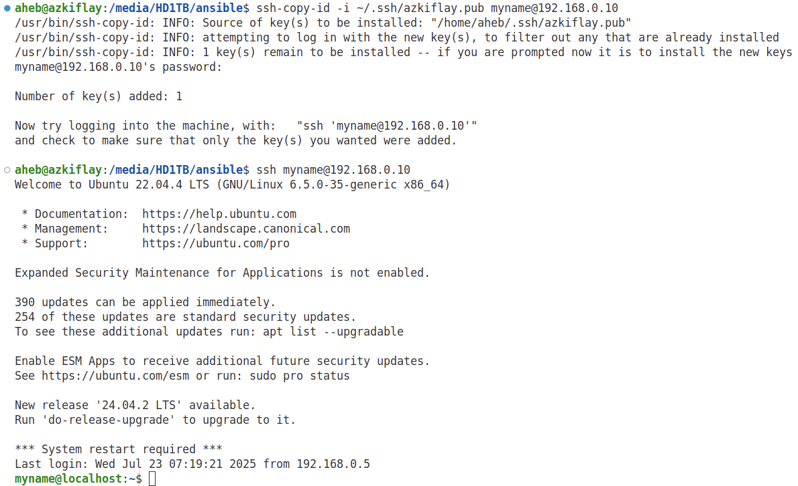

# Introduction to Configuraiton Management
Servers can be configured individually, but doing so is tiring, time-consuming and error prone. Ansible is a configuration management (CM) tool that enables system administrators to control state of servers. Puppet, Chef, and Salt are other CM tools. CM tools are used to define and enforce desired state for servers. For example, software package installation, configuration, permissions, and running the necessary services are among the things Ansible and other CMs can do. Ansible uses domain-specific language to describe the state of servers. Moreover, Ansible can be used for deployment of software ready to be released from a developers team. To achieve that, Ansible can copy the required files to servers, change configuration and environment variables, and start services in a particular order.

# Ansible
Ansible is an open-source Configuration Management (CM) tool that orchestrates infrastructure such as virtual machines (VMs). Ansible is written in Python. While tools such as Vagrant and Terraform are Infrastructure as Code (IaC) systems, Ansible is widely adopted to manage the configuration of the infrastructure. Ansible uses Yet Another Markup Language (YAML) to describe the desired state of infrastructure, making Ansible have a *declarative* configuration style rather than *imperative* where the user specifies detailed description of the infrastructure.

Unlike other CM systems, Ansible is agentless, it does not require a software agent to be installed on the managed servers. Ansible relies on Secure Shell (SSH) to push configuration to servers and make the desired changes. With SSH being the most secure method to connect to remote hosts, Ansible leverages SSH to configure a number of servers of the network.

using Ansible (User and Group Mangement, Two-factor authentication over SSH, User security policy such as controlling user commands, Host-based Firewall Automation)


# Ansible Installation on Ubuntu 24.04 LTS
Instructions to install Ansible for major operating systems is available at https://docs.ansible.com/ansible/latest/installation_guide/installation_distros.html. To install Ansible in Ubuntu, the following steps have been followed.

```bash
sudo apt update
sudo apt install software-properties-common
sudo add-apt-repository --yes --update ppa:ansible/ansible
sudo apt install ansible
ansible --version
```

# Ansible Terminology
* Control node: a Unix/Linux machine where Ansible has been installed. Playbooks are run in control node to implement configuration of remote hosts. It is possible to have more than one control nodes. A Windows machine cannot be a control node.
* Managed nodes (hosts): Network devices or servers managed by Ansible.
* Inventory: a file that contains a list/group of hosts that an Ansible control node works with. Inventory is at the control node.
* Module: a piece of code that Ansible executes to perform specific actions on different OS and environments.
* Tasks: Units of action in Ansible. For example, a command to install software on a managed host is a task.
* Playbook: an *ordered* lists of tasks that can be run by the control node(s) to configure remote hosts.


# Telling Ansible About Your Servers
```bash
  cd ansible #
  mkdir inventory
  cd inventory
  touch vagrant.ini
  nano vagrant.ini
  ansible testserver -i ./inventory/vagrant.ini -m ping
```

# Configuring SSH
The objective is to setup key-based authentication from the Ansible controller node to managed nodes. The latter use public key of the former to authenticate the controller node, whose private key should be kept locally and securely. In other words, the public key should be known to the managed nodes for them to be able to create a message that can be read only using the private key of the controller node. The authentication process is automatically triggered at each node after the private and public key pair have been configured at the respective host.
## Creating public and private keys
The following command creates a private and public keys and saves them inside ".ssh" directory. The file name of the private key is ansible_key, while the public is ansible_key.pub.
```bash
  ssh-keygen -t rsa -f ~/.ssh/ansible_key
  ls -l ~/.ssh/ansible_key # Private key permissions
  nano  ~/.ssh/ansible_key # View the private key
  ls -l ~/.ssh/ansible_key.pub # Public key permissions
  nano ~/.ssh/ansible_key.pub # View the public key
```

## Transferring the public key to hosts
To be able to transfer the Ansible controller node's public key to the managed hosts, you need to have a password-based access to the latter. In other words, you should already be able to use *ssh* to login remotely to the managed hosts using the respective username and password as shown in the following example.
```bash
  ssh myname@192.168.0.10 # ssh-keygen -R 192.168.0.10 # deletes any old key entry from ~/.ssh/known_hosts
```

After ensuring the managed hosts can be accessed using a password-based authentication, the next step is to configure *ssh* to use the private and public keys created earlier for authenticating the Ansible controller with the managed hosts. But first we need to transfer the public key to the hosts. To that end, *ssh-copy-id* command followed by each host's IP address or domain name is used as shown in the following example. Since the public key was created with a custom name, so that is specified using the *-i* option.
```bash
  ssh-copy-id -i ~/.ssh/azkiflay.pub myname@192.168.0.10 # ssh-copy-id --> uses locally available keys to authorise logins on a remote machine
```

A passphrase is requested to access the private key (azkiflay) as shown in Figure 1. The password of the user account where the key pair were created is the passphrase.
<p align="center">
  
</p>
<p align="center"><strong>Figure 1:</strong> Unlocking the private key </p>

Following a successful entry of a passphrase, the public key of the Ansible controller is added to the remote host as depicted in Figure 2.
<p align="center">
  
</p>
<p align="center"><strong>Figure 2:</strong> Transferring public key to a remote host </p>

# Adding your SSH public keys to authorized_keys file in each managed host.
