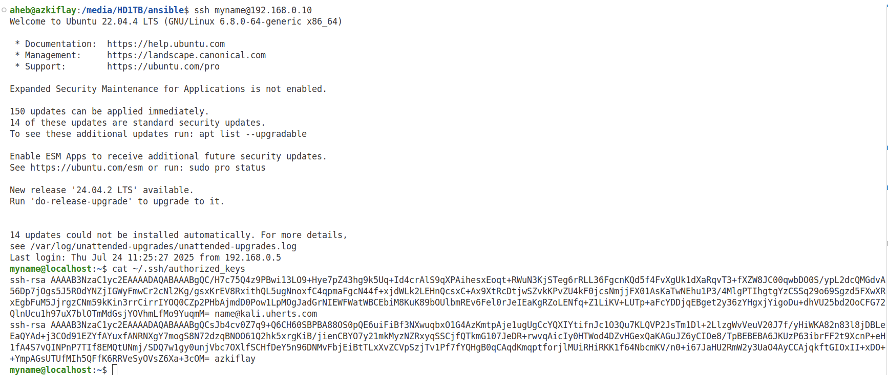

# Introduction to Ansible
Servers can be configured individually, but doing so is tiring, time-consuming and error prone. Ansible is an open-source Configuration Management (CM) tool that enables system administrators to control state of servers. Puppet, Chef, and Salt are other CM tools. CM tools are used to define and enforce desired state for servers, as well as other networked hosts and devices. For example, software package installation, configuration, permissions, and running the necessary services are among the things Ansible and other CMs can do. Ansible uses domain-specific language to describe the state of servers. Moreover, Ansible can be used for deployment of software ready to be released from a developers team. To achieve that, Ansible can copy the required files to servers, change configuration and environment variables, and start services in a particular order. 

Ansible orchestrates infrastructure such as virtual machines (VMs). Ansible is written in Python. While tools such as Vagrant and Terraform are Infrastructure as Code (IaC) systems, Ansible is widely adopted to manage the configuration of infrastructure. Ansible uses Yet Another Markup Language (YAML) to describe the desired state of infrastructure. As a result, Ansible has a *declarative* configuration style rather than *imperative*. In the latter the user specifies detailed description of the infrastructure, while a description of the infrastructre state suffices in Ansible.

Moreover, unlike other CM systems, Ansible is agentless because it does not require a software agent to be installed on the managed hosts. Ansible utilizes Secure Shell (SSH) to push configuration to hosts and make the desired changes accordingly. With SSH being the most secure method to connect to remote hosts, Ansible leverages SSH to configure a number of hosts.

<!-- Using Ansible (User and Group Mangement, Two-factor authentication over SSH, User security policy such as controlling user commands, Host-based Firewall Automation) -->

# Ansible Terminology
* Control node: a Linux/Unix machine where Ansible has been installed. It is possible to have more than one control nodes. A Windows machine cannot be a control node.
* Managed nodes (hosts): Network devices or servers managed by Ansible. Managed hosts do not have have Ansible installed on them.
* Inventory: a file that contains a list/group of hosts that an Ansible control node works with. Inventory file is created at the control node, specifying details of managed hosts such as IP addresses, and domain names. Host information in an inventory file can be organized in groups and subgroups.
* Module: a piece of code that Ansible executes to perform specific actions on different operating systems and environments. One more more modules can be used in tasks and playbooks.
* Tasks: Units of action in Ansible. For example, a command to install software on a managed host is a task.
* Playbook: an *ordered* lists of tasks that can be run by the control node to configure remote hosts. Playbooks are run in control node to configure remote hosts. YAML is used to write playbooks, which can include tasks and variables.

# Ansible Installation
The following commands can be used to install Ansible on Ubuntu. While Ubuntu 24.04 LTS was used in this tutorial, the commands will likely work on other Ubuntu distributions with minor changes.

```bash
sudo apt update
sudo apt install software-properties-common
sudo add-apt-repository --yes --update ppa:ansible/ansible
sudo apt install ansible
ansible --version
```
Instructions to install Ansible in other major operating systems are available [here](https://docs.ansible.com/ansible/latest/installation_guide/installation_distros.html).

# How Ansible Workflow
* Ansible controller tracks the hosts it manages using its local inventory file.
* Uses *SSH* to connect to a host or groups of hosts in the inventory file.
* Transfers one or more Ansible modules to its target host(s).
* Executes the module(s) at the remote target host(s).


# Configuring SSH
Before the controller can do anything on the managed hosts, it needs to be connected to them. As stated earlier, such network connection is setup using SSH. Therefore, it is important to ensure SSH is available and configured correctly on the controller and managed hosts. Moreover, to avoid a rogue controller taking over the infrastructure, a key-based or passworkd-based authentication must be enforced. In most cases, a key-based authentication is preferrable. The next steps show how to configure public and private keys for SSH, requiring the controller to be authenticated by the remote hosts.

When a key-based authentication is setup, managed hosts can use public key of the controller node to authenticate it. The controller's private key should be kept locally and securely. In other words, the public key should be known to the managed nodes for them to be able to create a message that can be read only using the private key of the controller node. The rests of the authentication process is automatically triggered at each node after the private and public key pair have been configured at the respective hosts.

Firstly, public and private keys are generated at the controller. Secondly, the controller's public key has to be transferred to the managed hosts, letting them know about the controller and its public key. This requires a valid username and password to access a managed host and transfer the controller's public key. With the private and public keys in the right places and pre-existing password-based access at the managed hosts, the controller is then configured to connect to the managed hosts using a key-based authentication.

## Creating public and private keys
The *ssh-keygen* command is widely used to create the private and public keys for and at the controller. For example, the following creates a private and public keys and saves them inside the *~/.ssh* directory. The file name of the private key is *ansible_key*, while the public is *ansible_key.pub*. While any name can be given for the key pairs, the *ssh-keygen* command provides default names of *id_rsa*, and *id_rsa.pub*, for the private and public keys, respectively.
```bash
  ssh-keygen -t rsa -f ~/.ssh/ansible_key
  ls -l ~/.ssh/ansible_key # Private key permissions
  nano  ~/.ssh/ansible_key # View the private key
  ls -l ~/.ssh/ansible_key.pub # Public key permissions
  nano ~/.ssh/ansible_key.pub # View the public key
```

## Transferring the public key to hosts
To be able to transfer the controller's public key to the managed hosts, you need to have an existing password-based access to the latter. In other words, you should already be able to use *ssh* to login remotely to the managed hosts using the respective username and password as shown in the following example.
```bash
  ssh myname@192.168.0.10 # ssh-keygen -R 192.168.0.10 # deletes any old key entry from ~/.ssh/known_hosts
```

After ensuring the managed hosts can be accessed using a password-based authentication, the next step is to configure *ssh* to use the private and public keys created earlier for authenticating the Ansible controller with the managed hosts. But first we need to transfer the public key to the hosts. To that end, *ssh-copy-id* command followed by each host's IP address or domain name is used as shown in the following example. Since the public key was created with a custom name, so that is specified using the *-i* option.
```bash
  ssh-copy-id -i ~/.ssh/azkiflay.pub myname@192.168.0.10 # ssh-copy-id --> uses locally available keys to authorise logins on a remote machine
```

A passphrase is requested to access the private key (azkiflay) as shown in Figure 1. The password of the user account where the key pair were created is the passphrase.
<p align="center">
  
</p>
<p align="center"><strong>Figure 1:</strong> Unlocking the private key </p>

Following a successful entry of a passphrase, the public key of the Ansible controller is added to the remote host as depicted in Figure 2.
<p align="center">
  
</p>
<p align="center"><strong>Figure 2:</strong> Transferring public key to a remote host </p>

Therefore, the public key of the Ansible controller has been copied to the remote host's authorized_keys file. As a result, the controller can access the remote host without a password, using the public key. As shown in Figure 3, when *ssh myname@192.168.0.10* is issued to access remote host, no prompt appears asking for a password. 
```bash
  ssh myname@192.168.0.10 
  # ssh -p port_number myname@192.168.0.10 # If ssh is not running on the default port number 22
  # ssh myname@192.168.0.10 command_to_run # To execute a single command on a remote system
  # ssh -X myname@192.168.0.10 # If X11 forwarding is enabled on both local and remote systems
  exit # Terminate the connection
```

The reason for the passwordless login is because the public key of the controller has now been added to the remote host's authorized_keys file. The presence of the public key at the remote host can be verified using *nano ~/.ssh/authorized_keys" by connecting to it. With regards to the private key, the clue is in the name. It should be kept private and secure at the controller, which uses it to decrypt messages from remote hosts.

<p align="center">
  
</p>
<p align="center"><strong>Figure 3:</strong> Public key-based access to a remote host </p>

## SSH on Windows Hosts
Configure the Windows host according to the following steps.
* Run PowerShell as Administrator and Install OpenSSH Server:
```bash
  Add-WindowsCapability -Online -Name OpenSSH.Server~~~~0.0.1.0
```
* Start and enable the SSH server:
```bash
  Start-Service sshd
  Set-Service -Name sshd -StartupType 'Automatic'
```

* Allow SSH through the firewall:
```bash
  netsh advfirewall firewall add rule name="OpenSSH-Server-In-TCP" dir=in action=allow protocol=TCP localport=22
```

* Ensure password login is allowed (temporarily): Open and edit C:\ProgramData\ssh\sshd_config in a text editor (run as Administrator). Find (or add) the following.
```bash
  PasswordAuthentication yes
  PubkeyAuthentication yes
```

Save and then restart the SSH service.
```bash
  Restart-Service sshd
```
Now you can connect with a username & password from your Unix host.

On the Unix/Linux client (your server):
* Copy the public key to Windows using *ssh-copy-id*.

```bash
  ssh-copy-id -i ~/.ssh/azkiflay.pub aklil@192.168.0.11 # Expected prompt --> aklil@192.168.0.11's password:
```
Enter your Windows user password, and it will automatically create *C:\Users\<username>\.ssh\authorized_keys* with the correct key contents.

* Test key-based login:
```bash
`ssh aklil@192.168.0.11 # You should now log in without a password (if ssh-agent is running or your key has no passphrase).
```

Once key authentication is confirmed, you can go back to the Windows host and disable password logins for better security.
To that end, open the file "C:\ProgramData\ssh\sshd_config", set PasswordAuthentication to *no*.
```bash
  PasswordAuthentication no
```
Restart the *sshd* service.

All the above steps can be done in one go using a PowerShell script shown below.
A PowerShell Setup Script (run as Administrator on the Windows host). Save the script as azkiflay_sshd.ps1. Open CMD as Administrator and run the script by typing *powershell -File azkiflay_sshd.ps1*.

```bash
  Add-WindowsCapability -Online -Name OpenSSH.Server~~~~0.0.1.0 # Install OpenSSH Server if not installed
  Start-Service sshd # Start and enable the SSH Server service
  Set-Service -Name sshd -StartupType 'Automatic' 
  netsh advfirewall firewall add rule name="OpenSSH-Server-In-TCP" dir=in action=allow protocol=TCP localport=22 # Allow SSH through the firewall on port 22
  $sshdConfig = "C:\ProgramData\ssh\sshd_config" # Path to sshd_config
  # Backup original config
  if (Test-Path "$sshdConfig.bak" -eq $false) { 
      Copy-Item $sshdConfig "$sshdConfig.bak"
  }
  # Ensure password auth is enabled initially
  (Get-Content $sshdConfig) |
      ForEach-Object {
          $_ -replace '^#?PasswordAuthentication.*', 'PasswordAuthentication yes'
      } | Set-Content $sshdConfig
  Restart-Service sshd # Restart SSH service to apply changes
```

After transferring public key to the Windows host, run the following PowerShell script to disable password-based ssh logins. Save the script with an *.ps1* extension. In this case, the script has been saved as *azkiflay_sshd_config.ps1*. Open CMD as Administrator and run the script by typing *powershell -File azkiflay_sshd_config.ps1*.

```bash
  # --- Authentication settings ---
PubkeyAuthentication yes
PasswordAuthentication no   # disable password logins after key is set up

# Allow only specific users (optional, replace with your username)
# AllowUsers yourwindowsusername

# --- Logging ---
SyslogFacility AUTH
LogLevel INFO

# --- Misc recommended options ---
PermitEmptyPasswords no
PermitRootLogin no
UseDNS no
Restart-Service sshd

```


# Telling Ansible About Your Servers
```bash
  cd ansible #
  mkdir inventory
  cd inventory
  touch vagrant.ini
  nano vagrant.ini
  ansible testserver -i ./inventory/vagrant.ini -m ping
```
