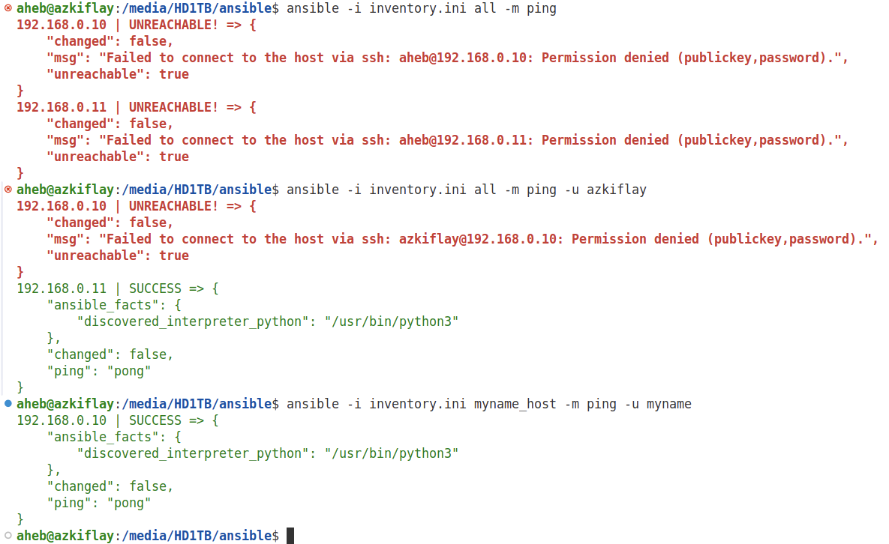
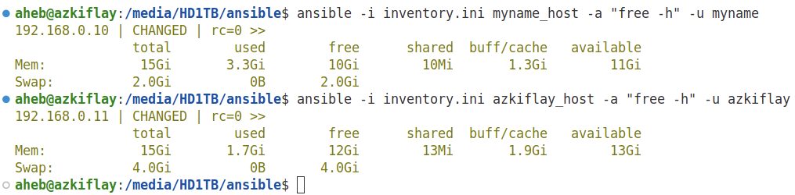

# Introduction
Online services and applications are supported by physical and virtual servers. These servers can be configured individually, but doing so is tiring, time-consuming and error prone. Ansible is an open-source Configuration Management (CM) tool that enables system administrators to control the state of servers. [Puppet](https://www.puppet.com/), [Chef](https://www.chef.io/products/chef-infra), and [Salt](https://saltproject.io/) are other CM tools. CM tools are used to define and enforce desired state for servers, as well as other networked hosts and devices. For example, software package installation, configuration, permissions, and running the necessary services are among the things Ansible and other CMs can do. 

Ansible is written in Python, and it uses a domain-specific language ([DSL](https://en.wikipedia.org/wiki/Domain-specific_language)) to describe the state of servers. Moreover, Ansible can be used for deploying software that is ready to be released from a developers team. To achieve that, Ansible copies required files to servers, change configuration and environment variables, and start services in a particular order. 

<!-- Moreover, Ansible orchestrates infrastructure such as virtual machines (VMs) and containers. -->
While tools such as [Vagrant](https://developer.hashicorp.com/vagrant) and [Terraform](https://developer.hashicorp.com/terraform) are systems that orchestrate infrastructure such as virtual machines (VMs) and containers, Ansible manages the configuration of the infrastructure. Terraform and Vagrant are Infrastructure as Code (IaC) tools. Once server infrastructure has been created using IaC tools, Ansible automates the configuration, versioning, and management of the infrastructure. 

Ansible utilizes Yet Another Markup Language (YAML) to describe the desired state of infrastructure. As a result, Ansible has a *declarative* configuration style rather than *imperative*. In the case of the latter, the user is required to specify the exact details of the infrastructure, while a simpler description suffices in Ansible.

Moreover, unlike other CM systems, Ansible is agentless, meaning it does not require a software agent to be installed on managed hosts. This reduces security risks and administration costs. Because Ansible is installed only at a controller node and not at the managed hosts. From the controller node, Ansible uses Secure Shell (SSH) to push configuration to the managed hosts and make the desired changes accordingly. With SSH being the most secure method to connect to remote hosts, Ansible leverages SSH to configure a number of servers remotely.

<!-- Using Ansible (User and Group Mangement, Two-factor authentication over SSH, User security policy such as controlling user commands, Host-based Firewall Automation) -->

# Terminology and Workflow
* **Control node**: a Linux/Unix machine where Ansible has been installed. It is possible to have more than one control nodes. A Windows machine cannot be a control node.
* **Managed nodes (hosts)**: Network devices or servers managed by Ansible. Managed hosts do not have have Ansible installed on them.
* **Inventory**: a file that contains a list/group of hosts that an Ansible control node works with. Inventory file is created at the control node, specifying details of managed hosts such as IP addresses or domain names. Host information in an inventory file can be organized in groups and subgroups.
* **Module**: a piece of code that Ansible executes to perform specific actions on different operating systems and environments. One more more modules can be used in *tasks* and *playbooks*, which are described next.
* **Tasks**: Units of action in Ansible. For example, a command to install software on a managed host is a task.
* **Playbook**: an *ordered* lists of tasks that can be run by the control node to configure remote hosts. Playbooks are run in control node to configure remote hosts. YAML is used to write playbooks, which can include tasks and variables.

Broadly, the Ansible workflow includes the following major steps:
* Ansible controller uses *SSH* to connect to a host or groups of hosts.
* The controller makes changes to host(s) using ad-hoc commands or using an inventory file.
* Transfers one or more Ansible modules to host(s).
* Executes the module(s) at the host(s).

# Installation
The following commands can be used to install Ansible on Ubuntu. While Ubuntu 24.04 LTS was used in this tutorial, the commands will likely work on other Ubuntu distributions with minor changes.

```bash
sudo apt update
sudo apt install software-properties-common
sudo add-apt-repository --yes --update ppa:ansible/ansible
sudo apt install ansible
ansible --version
```
Instructions to install Ansible in other major operating systems are available [here](https://docs.ansible.com/ansible/latest/installation_guide/installation_distros.html).

# SSH Configuration
Before the controller can do anything on the managed hosts, it needs to be connected to them. As stated earlier, such network connection is setup using SSH. Therefore, it is important to ensure SSH is available and configured correctly on the controller and managed hosts. Moreover, to avoid a rogue controller taking over the infrastructure, a key-based or passworkd-based authentication must be enforced. In most cases, a key-based authentication is preferrable. The next steps show how to configure public and private keys for SSH, requiring the controller to be authenticated by the remote hosts.

When a key-based authentication is setup, managed hosts can use public key of the controller node to authenticate it. The controller's private key should be kept locally and securely. In other words, the public key should be known to the managed nodes for them to be able to create a message that can be read only using the private key of the controller node. The rests of the authentication process is automatically triggered at each node after the private and public key pair have been configured at the respective hosts.

Firstly, public and private keys are generated at the controller. Secondly, the controller's public key has to be transferred to the managed hosts, letting them know about the controller and its public key. This requires a valid username and password to access a managed host and transfer the controller's public key. With the private and public keys in the right places and pre-existing password-based access at the managed hosts, the controller is then configured to connect to the managed hosts using a key-based authentication.

## Creating public and private keys
The *ssh-keygen* command is widely used to create the private and public keys for and at the controller. For example, the following creates a private and public keys and saves them inside the *~/.ssh* directory. The file name of the private key is *ansible_key*, while the public is *ansible_key.pub*. While any name can be given for the key pairs, the *ssh-keygen* command provides default names of *id_rsa*, and *id_rsa.pub*, for the private and public keys, respectively.

```bash
  ssh-keygen -t rsa -f ~/.ssh/ansible_key
  ls -l ~/.ssh/ansible_key # Private key permissions
  nano  ~/.ssh/ansible_key # View the private key
  ls -l ~/.ssh/ansible_key.pub # Public key permissions
  nano ~/.ssh/ansible_key.pub # View the public key
```

## Transferring the public key to hosts
To be able to transfer the controller's public key to the managed hosts, you need to have an existing password-based access to the latter. In other words, you should already be able to use *ssh* to login remotely to the managed hosts using the respective username and password as shown in the following example.

```bash
  ssh azkiflay@192.168.0.10 # ssh-keygen -R 192.168.0.10 # deletes any old key entry from ~/.ssh/known_hosts
```

After ensuring the managed hosts can be accessed using a password-based authentication, the next step is to configure *ssh* to use the private and public keys created earlier for authenticating the Ansible controller with the managed hosts. But first we need to transfer the public key to the hosts. To that end, *ssh-copy-id* command followed by each host's IP address or domain name is used as shown in the following example. Note that the public key was created with a custom name earlier. Therefore, that the name of the public key has to be specified using the *-i* option.

```bash
  ssh-copy-id -i ~/.ssh/azkiflay.pub azkiflay@192.168.0.10 # ssh-copy-id --> uses locally available keys to authorise logins on a remote machine
  ssh-copy-id -i ~/.ssh/azkiflay.pub azkiflay@192.168.0.11
  ssh-copy-id -i ~/.ssh/azkiflay.pub azkiflay@192.168.0.12
  ssh-copy-id -i ~/.ssh/azkiflay.pub azkiflay@192.168.0.13
  ssh-copy-id -i ~/.ssh/azkiflay.pub azkiflay@192.168.0.14
```

A passphrase is requested to access the private key, "azkiflay" in this case, as shown in Figure 1. The password of the user account where the key pair were created is the passphrase.
<p align="center">
  
</p>
<p align="center"><strong>Figure 1:</strong> Unlocking the private key </p>

Following a successful entry of a password, the public key of the Ansible controller is added to the remote host as depicted in Figure 2.
<p align="center">
  
</p>
<p align="center"><strong>Figure 2:</strong> Transferring public key to a remote host </p>

Therefore, the public key of the Ansible controller has been copied to the remote host's authorized_keys file. As a result, the controller can now access the remote host without a password, using the public key. As shown in Figure 3, when "*ssh azkiflay@192.168.0.10*" is issued to access remote host, no prompt appears asking for a password.

```bash
  ssh azkiflay@192.168.0.10 
  # ssh -p port_number azkiflay@192.168.0.10 # If ssh is not running on the default port number 22
  # ssh azkiflay@192.168.0.10 command_to_run # To execute a single command on a remote system
  # ssh -X azkiflay@192.168.0.10 # If X11 forwarding is enabled on both local and remote systems
  exit # Terminate the connection
```

The reason for the passwordless login is because the public key of the controller has now been added to the remote host's authorized_keys file. The presence of the public key at the remote host can be verified using "*cat ~/.ssh/authorized_keys*" by connecting to it. With regards to the private key, the clue is in the name. It should be kept private and secure at the controller, which uses it to decrypt messages from remote hosts. Figure 3 depicts that the Ansible controller has been successfully authenticated by managed host (192.168.0.10). This was possible because the host has the controller's public key in its *authorized_keys* files, also shown in the second line of the "*~/.ssh/authorized_keys*"" command issued at the managed host.

<p align="center">
  
</p>
<p align="center"><strong>Figure 3:</strong> Public key-based access to a remote host </p>

# Inventory
Ansible is a configuration management system, and for the controller to enforce any sort of configuration changes on servers, first it must keep a list of the servers using their IP addresses or domain names. Such a list is known as "*inventory file*", which Ansible uses to track the hosts that it manages. 

The default location for system-wide inventory file is under "*/etc/ansible/hosts*". But this is not always the case, depending on the way Ansible is installed. For example, the "*apt*"-based installation in Ubuntu 24.04 does not create "*/etc/ansible/hosts*". In any case, it is recommended to maintain an inventory for each project separately. Conveniently, the inventory file can be named "*inventory.ini*" or "*hosts.ini*". But it can be given any other valid file name. While it is also possible to create the inventory file without any file extension, another common way to create the inventory file is as a YAML ("*.yml*") file. Essentially, the inventory file contains a list of hosts that the Ansible controller manages. Ansible can administer several hundreds and thousands of hosts. 

For for example, the following creates an inventory in the current directoy.
```bash
  nano ./inventory.ini
```
The following shows an example of inventory file that consists of five servers in it. Four of the servers are under two groups, *group1* and *group2*, while the first server is not grouped.
```bash
  192.168.0.10
  [group1]
  192.168.0.11
  192.168.0.12
  [group2]
  192.168.0.13
  192.168.0.14
  [group3]
  192.168.0.12
  192.168.0.14
```

The same inventory file can be created in YAML.
```bash
  nano ./inventory.yml
```
```bash
  all:
    hosts:
      192.168.0.10
    children:
      group1:
        hosts:
          192.168.0.11
          192.168.0.12
      group2:
        hosts:
          192.168.0.13
          192.168.0.14
      group3:
        192.168.0.12
        192.168.0.14
```
By default, there are *all* and *ungrouped* groups in Ansible. The former contains all hosts, while the latter contains hosts that do not belong to another group except all. In the above example, the host 192.168.0.10 belongs to *ungrouped*. The hosts 192.168.0.11 and 192.168.0.11 are members of *group1*. Hosts 192.168.0.13 and 192.168.0.14 belong to *group2*. Lastly, *group3* consists of hosts 192.168.0.12 and 192.168.0.14. Every host is a member of the *all* group. A host can belong to more than one group. Group memberships of a host are usually determined by *what* the host does, *where* it is located, and *when* in the development pipeline it is utilized.

There are ways to create hosts in an inventory using pattern matching, adding a range rather than listing each host. For example, *www[01:50].local* creates *50* hosts, while db-[a:z].local creates *26* hosts.


# Ad Hoc Commands
The whole point of automation using Ansible is to realize a change of state at the managed hosts. Restarting a server, creating users, copying files are examples of such changes of state, all of which can be implemented using ad hoc tasks or playbooks.

Considering the hosts defined in the *inventory.ini* file earlier, let us utilize ad hoc commands to check connectivity of the controller to the managed host. The following two commands do just that.

```bash
  ansible -i inventory.ini azkiflay_host -m ping -u azkiflay
  ansible -i inventory.ini azkiflay_host -m ping -u azkiflay
```
 Note the *-i*, *-m*, and *-u* options are used to specify the inventory file at the controller, the command to execute, and a user name at the managed host, respectively.

Figure 4 shows the results of the ad hoc ansible tasks above. The ping results indicate that the controller can reach both hosts successfully.
<p align="center">
  
</p>
<p align="center"><strong>Figure 4:</strong> Checking controller's to hosts using ad hoc command </p>

The first ad hoc command results in "UNREACHABLE!" error for both hosts. Paricularly, the *msg* part of the results states ""msg": "Failed to connect to the host via ssh: aheb@192.168.0.10: Permission denied (publickey,password)". This makes sense because the local username *aheb* does not exist on both of the hosts in the inventory.ini file. 

```bash
  ansible -i inventory.ini all -m ping # all --> target all hosts in that inventory.
```

To tackle this problem, the username on a host can be specified using the *-u* option, as has been done in the following.

```bash
  ansible -i inventory.ini all -m ping -u azkiflay # returns error on one of the hosts, but successful on the other host
```

Figure 5 shows the full results of the various ad hoc commands that test connectivity of the ansible controller and the hosts in its inventory.ini file.
<p align="center">
  
</p>
<p align="center"><strong>Figure 5:</strong> Checking controller's to hosts using ad hoc command </p>

Having tested the connectivity, lets get some details about the hosts in the inventory.ini file. Fromt the controller node, the "free -h" command can be run on azkiflay_host (192.168.0.11) and the azkiflay_host (192.168.0.10) with the results shown in Figure 6.

```bash
  ansible -i inventory.ini azkiflay_host -a "free -h" -u azkiflay
  ansible -i inventory.ini azkiflay_host -a "free -h" -u azkiflay
```

<p align="center">
  
</p>
<p align="center"><strong>Figure 6:</strong> Getting memory details of hosts using ad hoc commands </p>


# Playbooks
While ad hoc commands are useful for running one-off tasks, they are not suitable for many tasks that have to be done in a repeatable manner. That's where *playbooks* come in. Playbooks,  are a set of instructions that aim to bring server(s) to a specific configuration state. Playbooks are written in YAML, and they are to be executed (*played*) on the managed server(s). Playbooks can be subsets of playbooks.

To illustrate, assume we want to remove an existing *Apache2* installation from the 192.168.0.10 host. Shell commands are one way to do that. As discussed earlier, ad hoc commands in ansible can be used to issue one-off shell commands. Alternatively, we can *ssh* to the remote host and run the commands step-by-step to unistall the *Apache2* package. Since the ad hoc commands require setting various options as shown earlier, let us just *ssh* to the host and uninstall *Apache2* as shown below. Let us save the shell script as "*remove_apache.sh*" at the controller. 

```bash
  #!/bin/bash
  apache2 -v
  systemctl stop apache2 # Stop Apache
  systemctl disable apache2 # Disable Apache
  apt purge apache2 -y # Purge Apache packages and clean up dependencies
  apt autoremove -y
  apt autoclean
  rm -rf /etc/apache2 # Remove Apache configuration directory  
  rm -rf /var/log/apache2 # Remove Apache log files
  rm -rf /var/www/html # Remove default web root (CAUTION: deletes /var/www/html)
  rm -rf /var/www
  which apache2 || echo "apache2 not found" # Verify apache2 binary no longer exists
  systemctl status apache2 || echo "apache2 service not found" # Verify apache2 service no longer exists
```

However, we want to execute the shell script at the remote host. Therefore, first the file has to be copied over to the managed host. We can use *scp* or *rsync* commands for that purpose as shown in the following. Subsequnetly, the shell script can be run to uninstall the Apache2 software.

```bash
  scp remove_apache.sh azkiflay@192.168.0.10:/tmp/remove_apache.sh # Or --> rsync -avz remove_apache.sh azkiflay@192.168.0.10:/tmp/remove_apache.sh
  ssh azkiflay@192.168.0.10
  sudo sh /tmp/remove_apache.sh # --> If successful, returns "apache2 service not found" message at the end.
```

You may be wondering what is the problem with the above shell script. After all, it does what is supposed to do, at least in this case. The problem arises when we want apply a similar set of operation on multiple servers in a repeatable and safe manner. That is where ansible playbooks come in.

To easily compare with the previous commands for unistalling Apache, let us convert the contents of "*remove_apache.sh*" shell script to an equivalent ansible playbook. First, the apache2 package needs to be installed at the 192.168.0.10 machine, as the package was removed by the "*remove_apache.sh" script. Let us save the script in a "*install_apache.sh*". Subsequently, the script is copied over to the target host and run there to install *apache2*.

```bash
  #!/bin/bash
  echo "=== Updating package list ==="
  apt update
  echo "=== Installing Apache2 ==="
  apt install apache2 -y
  echo "=== Recreating default web root directories ==="
  mkdir -p /var/www/html
  chown -R www-data:www-data /var/www
  chmod -R 755 /var/www
  echo "=== Enabling and starting Apache2 service ==="
  systemctl enable apache2
  systemctl start apache2
  echo "=== Verifying Apache2 installation ==="
  apache2 -v || echo "Apache2 not found"
  systemctl status apache2 --no-pager || echo "Apache2 service not found"
  echo "=== Apache2 reinstallation complete! ==="
```

```bash
  rsync -avz install_apache.sh azkiflay@192.168.0.10:/tmp/install_apache.sh # Or --> scp remove_apache.sh azkiflay@192.168.0.10:/tmp/remove_apache.sh
  ssh azkiflay@192.168.0.10
  sudo sh /tmp/install_apache.sh # --> If successful, returns "apache2 service not found" message at the end.
```

Run the remove_apache.yml playbook as follows:

```bash
  ansible-playbook -i inventory.ini install_apache.yml --list-hosts # View affected hosts
  ansible-playbook -i inventory.ini remove_apache.yml -u azkiflay --become  --ask-become-pass # state: absent --> to remove package
```

To run the install_apache.yml playbook:
```bash
  ansible-playbook -i inventory.ini install_apache.yml -u azkiflay --become  --ask-become-pass # state: present, state: latest --> to install package
```

# Sample Application: Moodle
## Local
```bash
  ansible-galaxy collection install community.general
  ansible-galaxy collection install community.mysql
  ssh azkiflay@192.68.0.11
  sudo apt install python3-pip
  exit
  ansible-playbook -i inventory.ini playbook.yml -u azkiflay --become --ask-become-pass --limit azkiflay_host  --check 
  ansible-playbook -i inventory.ini playbook.yml -u azkiflay --become --ask-become-pass --limit azkiflay_host 
  ansible-playbook -i inventory.ini playbook.yml -u azkiflay --become --ask-become-pass --limit azkiflay_host  --check 
  ansible-playbook -i inventory.ini playbook.yml -u azkiflay --become --ask-become-pass --limit azkiflay_host
  ansible-playbook -i inventory.ini playbook.yml --become -ask-become-pass --limit azkiflay_vm
```

```bash
  ansible-playbook -i inventory.ini playbook.yml --limit ubuntuserver_vm1 -u azkiflay --become --ask-become-pass --check
```

```bash
  vagrant box add geerlingguy/rockylinux8 # Downloads Rocky Linux for virtualbox
  vagrant init geerlingguy/rockylinux8 # Creates `Vagrantfile` in current directory
  vagrant up
  vagrant ssh
  vagrant ssh-config
  vagrant halt
  vagrant destroy
```

# Future
* Packer: Build the base images (optional).
* Terraform: Provisions infrastructure (VMs, networks, cloud services), and deploy the image at scale in cloud or on-prem.
* Ansible: Configures the OS and software inside those machines
* Vagrant: used to spin up dev/test VMs quickly and to test the image locally.
* WinRM and SSH based connection between Ansible controller and managed hosts
* Real-world Ansible usage scenarios/projects


# Refrences
* Ansible for DevOps Server and configuration management for humans 2nd Edition, Jeff Geerling, Lean Publishing, 2023
  ** git clone https://github.com/geerlingguy/ansible-for-devops
* Ansible Website, https://docs.ansible.com/, Accessed 24 July - 8 August, 2025
* DevOps for the Desperate A Hands-on Survival Guide, Bradley Smith, No Starch Press, 2022
* Moodle: https://docs.moodle.org/500/en/Step-by-step_Installation_Guide_for_Ubuntu
